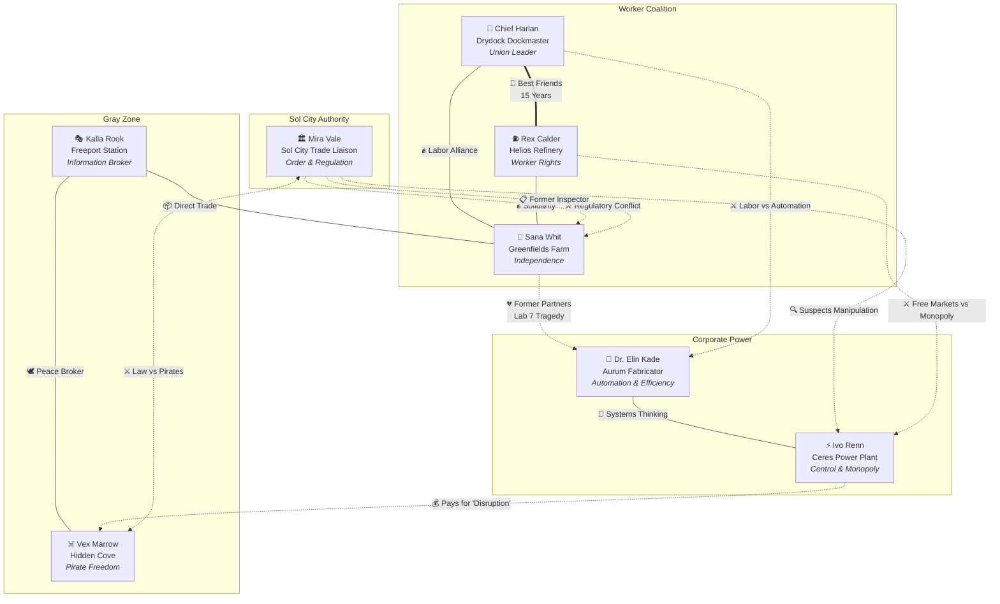
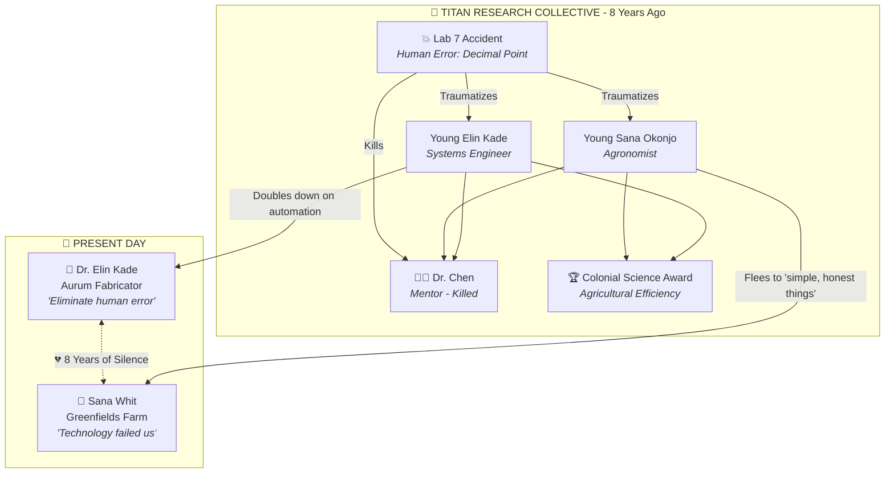
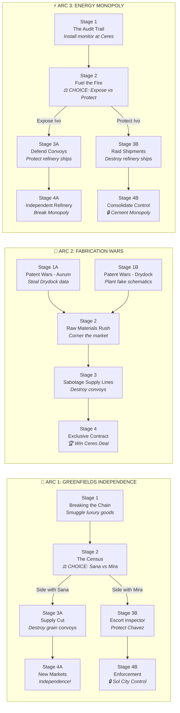
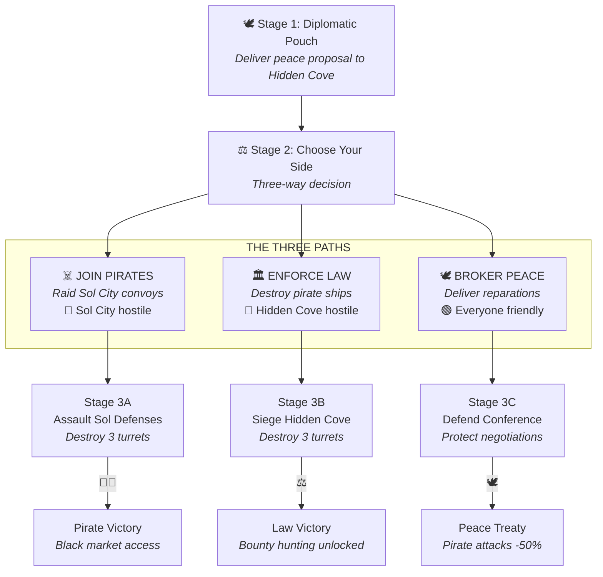
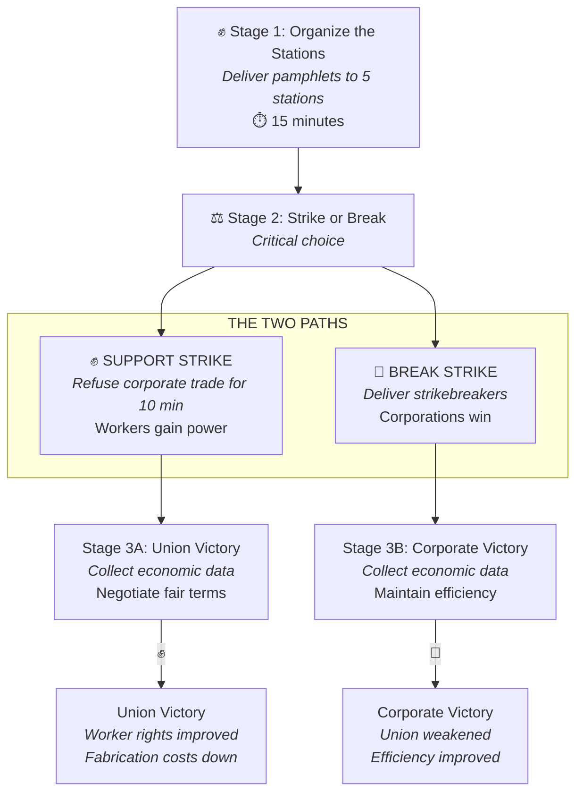
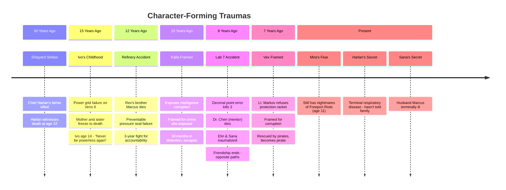
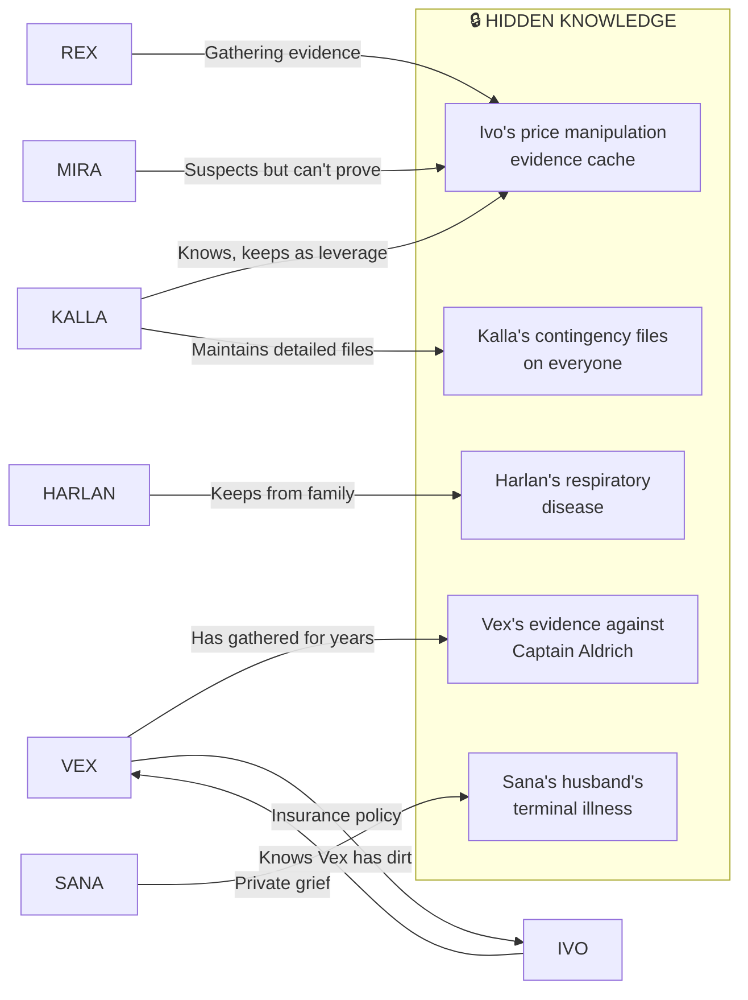
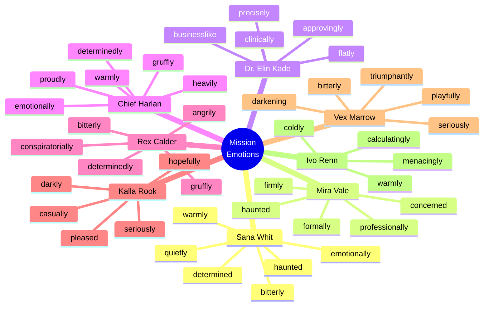

# Character Relationships & Story Arc Visualization

## Character Relationship Web



## The Lab 7 Connection

The central backstory tragedy that connects multiple characters:



## Story Arc Overview



## Pirate Accords - Three-Way Choice



## Union Crisis - The Final Arc



## Character Trauma Timeline



## Information & Leverage Web

Who knows what about whom:



## Voice & Emotion Guide

Each character's emotional range in mission dialogue:



---

## Mission Dialogue Audio Structure

Each mission includes these dialogue phases:

| Phase | Purpose | Lines | Audio Timing |
|-------|---------|-------|--------------|
| **Introduction** | Character backstory & mission briefing | 5-7 lines | ~45-60 sec |
| **Acceptance** | Short confirmation when accepted | 1 line | ~5 sec |
| **Key Moments** | Triggered during mission | 1-3 lines | ~10-15 sec each |
| **Completion Success** | Victory monologue | 3-5 lines | ~30-45 sec |
| **Completion Failure** | Optional failure response | 1 line | ~5-10 sec |

## File Structure

```
public/audio/missions/
├── manifest.json
├── greenfields/
│   ├── greenfields_stage_1/
│   │   ├── green_s1_intro_1.mp3
│   │   ├── green_s1_intro_2.mp3
│   │   └── ...
│   └── greenfields_stage_2/
│       └── ...
├── sol-city/
│   └── ...
├── aurum-fab/
│   └── ...
├── drydock/
│   └── ...
├── sol-refinery/
│   └── ...
├── freeport/
│   └── ...
├── ceres-pp/
│   └── ...
└── hidden-cove/
    └── ...
```

