# Character Relationships & Story Arc Visualization

## Character Relationship Web

```mermaid
graph TB
    subgraph "Sol City Authority"
        MIRA["🏛️ Mira Vale<br/>Sol City Trade Liaison<br/><i>Order & Regulation</i>"]
    end
    
    subgraph "Worker Coalition"
        HARLAN["🔧 Chief Harlan<br/>Drydock Dockmaster<br/><i>Union Leader</i>"]
        REX["⛽ Rex Calder<br/>Helios Refinery<br/><i>Worker Rights</i>"]
        SANA["🌾 Sana Whit<br/>Greenfields Farm<br/><i>Independence</i>"]
    end
    
    subgraph "Corporate Power"
        ELIN["🔬 Dr. Elin Kade<br/>Aurum Fabricator<br/><i>Automation & Efficiency</i>"]
        IVO["⚡ Ivo Renn<br/>Ceres Power Plant<br/><i>Control & Monopoly</i>"]
    end
    
    subgraph "Gray Zone"
        KALLA["🎭 Kalla Rook<br/>Freeport Station<br/><i>Information Broker</i>"]
        VEX["☠️ Vex Marrow<br/>Hidden Cove<br/><i>Pirate Freedom</i>"]
    end
    
    %% Estranged Friends (Lab 7 Trauma)
    SANA -.->|"💔 Former Partners<br/>Lab 7 Tragedy"| ELIN
    
    %% Worker Coalition Bonds
    HARLAN ===|"🤝 Best Friends<br/>15 Years"| REX
    HARLAN ---|"✊ Labor Alliance"| SANA
    REX ---|"✊ Solidarity"| SANA
    
    %% Corporate Collaboration
    ELIN ---|"🤝 Systems Thinking"| IVO
    
    %% Sol City Connections
    MIRA -.->|"⚔️ Regulatory Conflict"| SANA
    MIRA -.->|"🔍 Suspects Manipulation"| IVO
    
    %% Gray Zone Relations
    KALLA ---|"🕊️ Peace Broker"| VEX
    KALLA ---|"📦 Direct Trade"| SANA
    IVO -.->|"💰 Pays for 'Disruption'"| VEX
    
    %% Hostile Relations
    MIRA <-.->|"⚔️ Law vs Pirates"| VEX
    HARLAN -.->|"⚔️ Labor vs Automation"| ELIN
    REX -.->|"⚔️ Free Markets vs Monopoly"| IVO
    
    %% Shared History
    MIRA -.->|"📋 Former Inspector"| SANA
```



## The Lab 7 Connection

The central backstory tragedy that connects multiple characters:

```mermaid
flowchart TD
    subgraph PAST["🔬 TITAN RESEARCH COLLECTIVE - 8 Years Ago"]
        LAB7["💥 Lab 7 Accident<br/><i>Human Error: Decimal Point</i>"]
        CHEN["👨‍🔬 Dr. Chen<br/><i>Mentor - Killed</i>"]
        YOUNG_ELIN["Young Elin Kade<br/><i>Systems Engineer</i>"]
        YOUNG_SANA["Young Sana Okonjo<br/><i>Agronomist</i>"]
        AWARD["🏆 Colonial Science Award<br/><i>Agricultural Efficiency</i>"]
    end
    
    subgraph PRESENT["📍 PRESENT DAY"]
        ELIN_NOW["🔬 Dr. Elin Kade<br/>Aurum Fabricator<br/><i>'Eliminate human error'</i>"]
        SANA_NOW["🌾 Sana Whit<br/>Greenfields Farm<br/><i>'Technology failed us'</i>"]
    end
    
    YOUNG_ELIN --> AWARD
    YOUNG_SANA --> AWARD
    YOUNG_ELIN --> CHEN
    YOUNG_SANA --> CHEN
    
    LAB7 -->|"Kills"| CHEN
    LAB7 -->|"Traumatizes"| YOUNG_ELIN
    LAB7 -->|"Traumatizes"| YOUNG_SANA
    
    YOUNG_ELIN -->|"Doubles down on automation"| ELIN_NOW
    YOUNG_SANA -->|"Flees to 'simple, honest things'"| SANA_NOW
    
    ELIN_NOW <-.->|"💔 8 Years of Silence"| SANA_NOW
```



## Story Arc Overview

```mermaid
flowchart LR
    subgraph ARC1["🌾 ARC 1: GREENFIELDS INDEPENDENCE"]
        G1["Stage 1<br/>Breaking the Chain<br/><i>Smuggle luxury goods</i>"]
        G2["Stage 2<br/>The Census<br/><i>⚖️ CHOICE: Sana vs Mira</i>"]
        G3A["Stage 3A<br/>Supply Cut<br/><i>Destroy grain convoys</i>"]
        G3B["Stage 3B<br/>Escort Inspector<br/><i>Protect Chavez</i>"]
        G4A["Stage 4A<br/>New Markets<br/><i>🎉 Independence!</i>"]
        G4B["Stage 4B<br/>Enforcement<br/><i>🔒 Sol City Control</i>"]
    end
    
    G1 --> G2
    G2 -->|"Side with Sana"| G3A
    G2 -->|"Side with Mira"| G3B
    G3A --> G4A
    G3B --> G4B
    
    subgraph ARC2["🔧 ARC 2: FABRICATION WARS"]
        F1A["Stage 1A<br/>Patent Wars - Aurum<br/><i>Steal Drydock data</i>"]
        F1B["Stage 1B<br/>Patent Wars - Drydock<br/><i>Plant fake schematics</i>"]
        F2["Stage 2<br/>Raw Materials Rush<br/><i>Corner the market</i>"]
        F3["Stage 3<br/>Sabotage Supply Lines<br/><i>Destroy convoys</i>"]
        F4["Stage 4<br/>Exclusive Contract<br/><i>🏆 Win Ceres Deal</i>"]
    end
    
    F1A --> F2
    F1B --> F2
    F2 --> F3
    F3 --> F4
    
    subgraph ARC3["⚡ ARC 3: ENERGY MONOPOLY"]
        E1["Stage 1<br/>The Audit Trail<br/><i>Install monitor at Ceres</i>"]
        E2["Stage 2<br/>Fuel the Fire<br/><i>⚖️ CHOICE: Expose vs Protect</i>"]
        E3A["Stage 3A<br/>Defend Convoys<br/><i>Protect refinery ships</i>"]
        E3B["Stage 3B<br/>Raid Shipments<br/><i>Destroy refinery ships</i>"]
        E4A["Stage 4A<br/>Independent Refinery<br/><i>🎉 Break Monopoly</i>"]
        E4B["Stage 4B<br/>Consolidate Control<br/><i>🔒 Cement Monopoly</i>"]
    end
    
    E1 --> E2
    E2 -->|"Expose Ivo"| E3A
    E2 -->|"Protect Ivo"| E3B
    E3A --> E4A
    E3B --> E4B
```



## Pirate Accords - Three-Way Choice

```mermaid
flowchart TD
    P1["🕊️ Stage 1: Diplomatic Pouch<br/><i>Deliver peace proposal to Hidden Cove</i>"]
    
    P2["⚖️ Stage 2: Choose Your Side<br/><i>Three-way decision</i>"]
    
    subgraph CHOICES["THE THREE PATHS"]
        PIRATE["☠️ JOIN PIRATES<br/><i>Raid Sol City convoys</i><br/>🔴 Sol City hostile"]
        LAW["🏛️ ENFORCE LAW<br/><i>Destroy pirate ships</i><br/>🔴 Hidden Cove hostile"]
        PEACE["🕊️ BROKER PEACE<br/><i>Deliver reparations</i><br/>🟢 Everyone friendly"]
    end
    
    P3A["Stage 3A<br/>Assault Sol Defenses<br/><i>Destroy 3 turrets</i>"]
    P3B["Stage 3B<br/>Siege Hidden Cove<br/><i>Destroy 3 turrets</i>"]
    P3C["Stage 3C<br/>Defend Conference<br/><i>Protect negotiations</i>"]
    
    P1 --> P2
    P2 --> PIRATE
    P2 --> LAW
    P2 --> PEACE
    PIRATE --> P3A
    LAW --> P3B
    PEACE --> P3C
    
    P3A -->|"🏴‍☠️"| OUTCOME_P["Pirate Victory<br/><i>Black market access</i>"]
    P3B -->|"⚖️"| OUTCOME_L["Law Victory<br/><i>Bounty hunting unlocked</i>"]
    P3C -->|"🕊️"| OUTCOME_C["Peace Treaty<br/><i>Pirate attacks -50%</i>"]
```



## Union Crisis - The Final Arc

```mermaid
flowchart TD
    U1["✊ Stage 1: Organize the Stations<br/><i>Deliver pamphlets to 5 stations</i><br/>⏱️ 15 minutes"]
    
    U2["⚖️ Stage 2: Strike or Break<br/><i>Critical choice</i>"]
    
    subgraph PATHS["THE TWO PATHS"]
        STRIKE["✊ SUPPORT STRIKE<br/><i>Refuse corporate trade for 10 min</i><br/>Workers gain power"]
        BREAK["💼 BREAK STRIKE<br/><i>Deliver strikebreakers</i><br/>Corporations win"]
    end
    
    U3A["Stage 3A: Union Victory<br/><i>Collect economic data</i><br/>Negotiate fair terms"]
    U3B["Stage 3B: Corporate Victory<br/><i>Collect economic data</i><br/>Maintain efficiency"]
    
    U1 --> U2
    U2 --> STRIKE
    U2 --> BREAK
    STRIKE --> U3A
    BREAK --> U3B
    
    U3A -->|"✊"| OUTCOME_U["Union Victory<br/><i>Worker rights improved</i><br/><i>Fabrication costs down</i>"]
    U3B -->|"💼"| OUTCOME_C["Corporate Victory<br/><i>Union weakened</i><br/><i>Efficiency improved</i>"]
```



## Character Trauma Timeline


## Information & Leverage Web

Who knows what about whom:


## Voice & Emotion Guide

Each character's emotional range in mission dialogue:


---

## Mission Dialogue Audio Structure

Each mission includes these dialogue phases:

| Phase | Purpose | Lines | Audio Timing |
|-------|---------|-------|--------------|
| **Introduction** | Character backstory & mission briefing | 5-7 lines | ~45-60 sec |
| **Acceptance** | Short confirmation when accepted | 1 line | ~5 sec |
| **Key Moments** | Triggered during mission | 1-3 lines | ~10-15 sec each |
| **Completion Success** | Victory monologue | 3-5 lines | ~30-45 sec |
| **Completion Failure** | Optional failure response | 1 line | ~5-10 sec |

## File Structure

```
public/audio/missions/
├── manifest.json
├── greenfields/
│   ├── greenfields_stage_1/
│   │   ├── green_s1_intro_1.mp3
│   │   ├── green_s1_intro_2.mp3
│   │   └── ...
│   └── greenfields_stage_2/
│       └── ...
├── sol-city/
│   └── ...
├── aurum-fab/
│   └── ...
├── drydock/
│   └── ...
├── sol-refinery/
│   └── ...
├── freeport/
│   └── ...
├── ceres-pp/
│   └── ...
└── hidden-cove/
    └── ...
```

